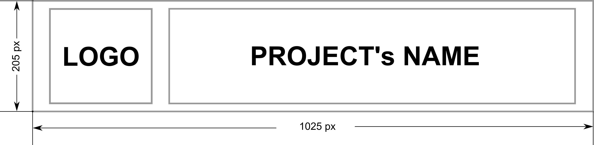

[![Tests][badge-tests]][link-tests] [![Documentation][badge-docs]][link-docs]

[badge-tests]: https://img.shields.io/github/actions/workflow/status/{{ cookiecutter.github_organization }}/{{ cookiecutter.project_slug }}/test.yaml?branch=main [link-tests]: {{ cookiecutter.project_repo }}/actions/workflows/test.yml [badge-docs]: https://img.shields.io/readthedocs/{{ cookiecutter.project_slug }} [link-docs]: https://{{ cookiecutter.project_slug }}.readthedocs.io

# {{ cookiecutter.project_name }}

{{ cookiecutter.readme }}

## Installation
1. Go to the projects directory:
```bash
cd {{ cookiecutter.project_slug  }}
```

2. Initialize a git repository for the project.
```bash
git init
```

3. Create a virtual environment with [uv](https://docs.astral.sh/uv/)
```bash
uv venv
source .venv/bin/activate
```

4. Install all the dependencies
```bash
uv pip install ".[dev,tests,docs]"
```

## Documentation
1. You can open a preview of the documentation by running:
```bash
mkdocs serve
```
